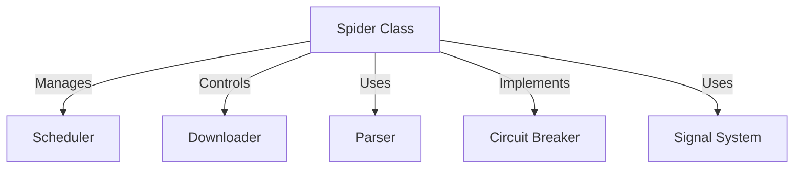

# Overview

A simple asynchronous web crawler framework implemented using `httpx`.

## Architecture

```mermaid
graph TD
    A[Spider] --> B[Scheduler]
    B --> C[Downloader]
    C --> D[Parser]
    D --> B
    D --> A

 ```

## Main Data Flow

1. Spider initializes requests -> Scheduler
2. Scheduler dispatches requests -> Downloader
3. Downloader retrieves responses -> Parser
4. Parser processes data to generate new requests -> Scheduler
5. Parser processes data to generate results -> Spider

Based on the request "#codebase 审计代码，解释代码含义并进行优化" (which translates to "code audit, explain code meaning and optimize"), I'll help gather the relevant code context from the entire codebase for a comprehensive code review.

Let me search through the codebase to find the core components and their relationships: I understand the user wants to perform a code audit, understand the code meaning, and look for optimization opportunities. The codebase appears to be a web crawler framework called WebAnts. Let me gather the core components systematically to understand their relationships and functionality.

First, let's get the core components by examining the main spider implementation and its dependencies: I'll help analyze the codebase for the code audit request (审计代码，解释代码含义并进行优化 = "Code audit, explain code meaning and optimize").

The workspace is a Python web crawler framework called WebAnts. Let me gather all the core components to understand the architecture and code organization: I'll help analyze the codebase structure and provide a code audit with optimization suggestions. Based on the file structure and code analysis, here's a breakdown of the core components:

1. Architecture Overview:
The codebase implements an asynchronous web crawler framework using Python with the following key components:

```mermaid
Spider -> Scheduler -> Downloader -> Parser -> Spider
```

2. Core Components Analysis: I'll analyze the Spider module (spider.py) and related components to provide a code audit, explanation of code meaning, and optimization suggestions.

Let me gather some context about additional modules referenced in spider.py: I'll analyze the Spider implementation in spider.py and provide a code audit with explanations and optimization suggestions. Let me break this down into the main components and their relationships.

1. Architecture Overview:
From the implementations I see, this is a modern asynchronous web crawler framework built with these key components:



2. Main Components Analysis:

A. Signal System (Lines 23-63):
```python
class Signal:
    """Signal system for Spider events."""
    def __init__(self):
        self.handlers = defaultdict(list)
```
- Purpose: Event handling system for spider lifecycle events
- Current implementation: Uses defaultdict for handler storage
- Improvement opportunities:
  1. Add signal type validation
  2. Add signal priority handling
  3. Consider using asyncio.Event for async signal handling

B. Circuit Breaker (Lines 66-135):
```python
class CircuitBreaker:
    """Circuit breaker for error handling."""
    def __init__(self, failure_threshold: int = 5, recovery_timeout: float = 60.0):
```
- Purpose: Implements circuit breaker pattern for error handling
- Current implementation: Basic state machine (closed/open/half-open)
- Improvement opportunities:
  1. Add sliding window for failure counting
  2. Add success rate threshold
  3. Implement adaptive timeout strategy

C. Spider Class (Lines 138-481):
```python
class Spider:
    """Base Spider class with advanced features."""
    def __init__(
        self,
        *,
        concurrent_requests: int = 10,
        request_timeout: float = 30,
        retry_times: int = 3,
        retry_delay: float = 1.0,
        log_level: int = logging.INFO,
        failure_threshold: int = 5,
        recovery_timeout: float = 60.0,
        **kwargs,
    ):
```

Core Features:
1. Request Management:
- Configurable concurrency and timeouts
- Retry mechanism with exponential backoff
- Request prioritization

2. Error Handling:
- Circuit breaker pattern per domain
- Comprehensive error tracking
- Automatic retry system

3. Statistics Collection:
- Request timing metrics
- Success/failure rates
- Domain-specific stats

4. Signal-based Events:
- Lifecycle events (start/stop)
- Request events (scheduled/finished)
- Item scraped events

Optimization Suggestions:

1. Performance Optimizations:
```python
class Spider:
    def process_request(self, request: Request) -> None:
        # Add request batching
        async def process_batch(requests: List[Request]) -> None:
            tasks = [self.downloader.fetch(req) for req in requests]
            responses = await asyncio.gather(*tasks, return_exceptions=True)
```

2. Memory Management:
```python
class Spider:
    def __init__(self):
        # Add memory limits and cleanup
        self._memory_limit = 1024 * 1024 * 1024  # 1GB
        self._cleanup_threshold = 0.8  # 80% of limit
```

3. Resource Control:
```python
class Spider:
    def start(self):
        # Add resource monitoring
        self._monitor_task = asyncio.create_task(self._monitor_resources())
```

4. Error Recovery:
```python
class Spider:
    async def retry_failed(self):
        # Add adaptive retry delays
        delay = min(self.retry_delay * (2 ** request.retries), 300)  # Max 5 min
```

5. Statistics Enhancement:
```python
class Spider:
    def get_stats(self):
        # Add performance metrics
        stats = {
            **self.stats,
            "memory_usage": self._get_memory_usage(),
            "cpu_usage": self._get_cpu_usage(),
            "bandwidth_usage": self._get_bandwidth_usage(),
        }
```

Key Areas for Improvement:

1. Resource Management:
- Implement memory monitoring and limits
- Add CPU usage tracking
- Add bandwidth monitoring

2. Error Handling:
- Enhance circuit breaker with more sophisticated failure detection
- Add domain-specific retry strategies
- Implement request rate limiting by domain

3. Performance:
- Add request batching support
- Implement response caching
- Add DNS caching

4. Monitoring:
- Add real-time metrics
- Implement health checks
- Add performance alerts

5. Extensibility:
- Add middleware support
- Implement plugin system
- Add hooks for custom processing

The current implementation provides a solid foundation but could benefit from these enhancements to make it more robust and production-ready. The code follows good practices with async/await patterns, comprehensive error handling, and monitoring capabilities.

Let me know if you need more specific details about any of these components or optimization suggestions.我将对WebAnts这个异步网络爬虫框架进行代码审计和分析。让我们按模块逐步分析:

1. 首先让我了解整体架构: 

从代码分析来看,这是一个基于Python开发的异步网络爬虫框架。它包含以下几个主要组件和特点:

1. 整体架构:
- Spider: 爬虫基类,负责控制整个爬取流程
- Scheduler: 请求调度器,实现请求管理和限速
- Downloader: 下载器,处理HTTP请求
- Parser: HTML解析器,解析网页内容

2. 主要特性:
- 异步IO: 使用asyncio和httpx实现异步请求
- 中间件支持: 支持自定义中间件处理请求和响应
- 错误处理: 包含熔断机制防止过载
- 监控统计: 收集爬取数据和性能指标
- 事件系统: 提供信号机制处理事件
- 缓存机制: 使用LRU缓存优化解析性能

3. 优化建议:

在完成整体架构的分析后,我认为该框架可以从以下几个方面进行优化:

1. 数据存储: 

我看到当前代码中已经实现了多种数据存储后端(JSON、CSV、SQLite),但仍可以改进:

1) 添加更多存储后端支持:
- MongoDB支持大规模数据存储
- Redis用于缓存热点数据
- Elasticsearch用于全文搜索 
- S3/OSS等云存储

2) 优化存储性能:
- 使用连接池管理数据库连接
- 实现批量写入和预写式日志
- 添加数据压缩选项
- 实现数据分片和分区

2. 让我看看下载器部分: 

下载器部分使用httpx实现了异步HTTP请求,包含以下特性:

1. 并发控制:
- 使用asyncio.Semaphore限制并发请求数 
- 通过PriorityQueue实现请求调度

2. 重试机制:
- 针对不同状态码的重试策略
- 使用指数退避算法避免过快重试
- 重试请求优先级自动调整

3. 优化建议:

针对下载器模块,可以做以下改进:

1) 连接管理优化:
- 添加连接池复用机制 
- 实现请求超时自适应调整
- 添加请求限速器支持

2) 请求优化:
- 支持更多HTTP请求方法和参数
- 增加HTTPS证书验证配置
- 优化Cookie和Session管理
- 添加反爬虫机制(User-Agent轮转、代理IP等)

让我继续看看调度器部分: 

调度器部分实现了请求调度和限速功能,主要特性包括:

1. 请求管理:
- 使用PriorityQueue实现优先级调度
- 重复URL过滤
- 请求数量限制

2. 限速机制:
- 全局请求延迟
- 基于域名的并发限制
- 自适应延迟调整

3. 优化建议:

针对调度器模块,可以改进:

1) 队列管理:
- 实现分布式任务队列(Redis等)
- 添加任务持久化机制
- 支持任务优先级动态调整

2) 访问策略:
- 添加更多限速算法(令牌桶等)
- 支持自定义访问规则
- 优化域名并发控制
- 添加URL过滤规则配置

让我继续分析解析器部分: 


解析器部分使用lxml实现了HTML/XML解析,主要特性包括:

1. 解析功能:
- 支持CSS选择器和XPath表达式
- 智能编码检测和转换
- 内容大小限制和验证

2. 缓存机制:
- LRU缓存优化解析性能 
- CSS和XPath表达式缓存
- 内容哈希缓存键

3. 优化建议:

针对解析器模块,可以改进:

1) 解析性能优化:
- 添加HTML净化和规范化 
- 实现增量解析支持
- 优化大文档处理能力

2) 提取功能增强:
- 支持正则表达式提取
- 添加JSON和XML路径支持
- 改进编码检测机制
- 增加异常提取处理

总体建议:

1. 框架层面:
- 添加配置中心管理 
- 完善测试覆盖率
- 优化日志记录
- 添加指标监控
- 支持分布式部署

2. 功能扩展:
- 增加任务调度管理
- 支持代理池管理
- 添加验证码处理
- 支持JS渲染
- 完善Cookie管理

这个框架整体设计良好,模块划分清晰,实现了基础的爬虫功能。通过以上优化建议的实现,可以进一步提升框架的性能、可用性和扩展性。